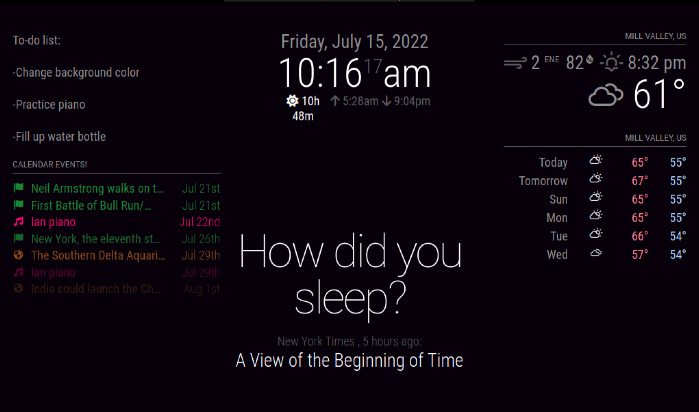

# Magic Mirror
A mirror with a monitor on the back of it to show helpful information (time, weather, calendar events, news articles, and more) to get you ready for your day!


| **Engineer** | **School** | **Area of Interest** | **Grade** |
|:--:|:--:|:--:|:--:|
| Ian Mooney | San Franscisco Univeristy High School | Engineering | 10th Grade 




# Final Milestone
Final Milestone Video: 
In my final milestone video, I finished all of the customizations of my project and I have learned that checking the documentation for an engineering project is a great way to get a deeper understanding of the work that went into the project and learn how to modify it. When someone documents their work, others can follow behind with improvements and ideas that would otherwise not be possible. The documentation made it so much easier for me to change the original Magic Mirror project, and I am very grateful for their hard work.
<iframe width="832" height="478.86" src="https://www.youtube.com/embed/m0WJbs9DMS4" title="YouTube video player" frameborder="0" allow="accelerometer; autoplay; clipboard-write; encrypted-media; gyroscope; picture-in-picture" allowfullscreen></iframe>

# Second Milestone
Second Milestone Video:
In this milestone video, I just finished my base project with all the default modules. I got the display working and most of the modules are working the way they are intended to do. The one thing that I need to change is the fact that the compliments are way too big, and they are overlapping with the other modules. For my final milestone, I a plan on making everything look cleaner, and maybe take out some of the components to keep the visuals very simple and easy to look at.
<iframe width="832" height="478.86" src="https://www.youtube-nocookie.com/embed/5ns3Hgkc2UI" title="YouTube video player" frameborder="0" allow="accelerometer; autoplay; clipboard-write; encrypted-media; gyroscope; picture-in-picture" allowfullscreen></iframe>

# First Milestone
First Milestone Video:
I have just set up all of the basic components to help me get ready to modify my project. I have imported the code from the original Magic Mirror website into Visual Studio Code (VS Code) (What I will use to modify the code) and (at least tried to) set up the monitor which will go on the back of the mirror and give the illusion that the mirror is a mini-display. The raspberrypi is all set up and has a memory card in it that will hold the modified code. I can access it from my computer using VS Code as long as it's plugged in.
<iframe width="832" height="478.86" src="https://www.youtube-nocookie.com/embed/hI0jVcSuaf8" title="YouTube video player" frameborder="0" allow="accelerometer; autoplay; clipboard-write; encrypted-media; gyroscope; picture-in-picture" allowfullscreen></iframe>


# Materials Used and Prices:

| **Raspberry Pi Model B 64 Bit** | **SunFounder 7 Inch HD TFT LCD Screen Monitor** | **5.9Ft Raspberry-Pi-4 Power Supply USB-C** | **UGREEN SD Card Reader USB 3.0** | **Micro Center Premium 64GB microSDXC Card** |
|:--:|:--:|:--:|:--:|:--:|
| $119.90 | $54.99 | $9.79 | $11.00 | $7.91 


# Some Code Examples That I Changed

Weather module:
```js
{
	module: "weather",
	position: "top_right",
	header: 'Mill Valley, US',
	config: {
		weatherProvider: "openweathermap",
		units: 'imperial',
		tempUnits: "imperial",
		windUnits: "imperial",
		roundTemp: true,
		timeFormat: '12',
		type: 'current',
		initialLoadDelay: 3000,
		onlyTemp: false,
		showFeelsLike: false,
		showWindDirectionAsArrow: false,
		showPeriod: true,
		showSun: true,
		colored: true,
		fade: false,
		showWindDirection: true,
		showHumidity: true,
		tableClass: 'small',
		maxNumberOfDays: '9',
		apiBase: 'https://api.openweathermap.org/data/',
		weatherEndpoint: "/weather",
		locationID: "5373121",
		apiKey: "43de70266a95c9e974d55115a0097e6a"
	}
}
```


Compliments for when there is a thunderstorm:
```js
thunderstorm: [
		"Thunder? Lightning? What is this: Florida?!?",
		"Apparently it's thundering outside",
		"Don't go in the pool right now!",
		"Look outside and see the flashes of lighting!",
		"Thunderbolts and lightning, very very frightning"
		]
```


Some of the formatting:
```css
:root {
  --color-text: #999;
  --color-text-dimmed: #666;
  --color-text-bright: #fff;
  --color-background: rgb(6, 0, 9);

  --font-primary: "Roboto Condensed";
  --font-secondary: "Roboto";

  --font-size: 18px;
  --font-size-small: 0.75rem;

  --gap-body-top: 20px;
  --gap-body-right: 20px;
  --gap-body-bottom: 60px;
  --gap-body-left: 20px;

  --gap-modules: 20px;
}
```


