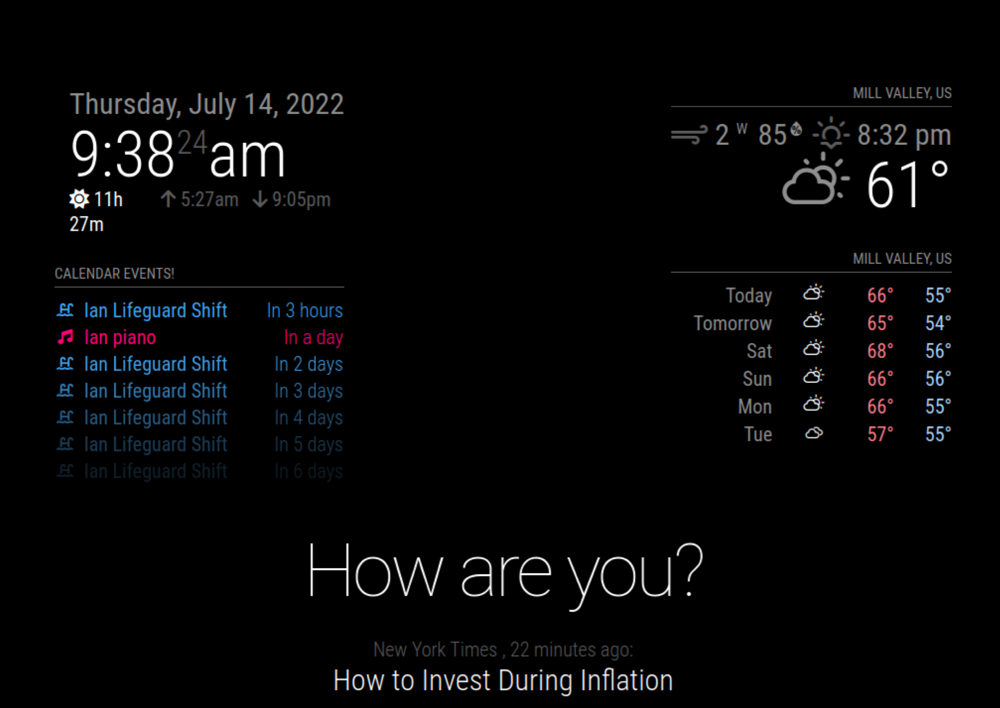

# Magic Mirror
A mirror with a monitor on the back of it to show helpful information (like the time, weather, calander events, news articles, and more) to get you ready for your day!

| **ENGINEER** | **School** | **Area of Interest** | **Grade** \
|:--:|:--:|:--:|:--:|
| Ian Mooney | San Franscisco Univeristy High School | Engineering | 10th Grade 

# First Milestone
First Milestone Video:
I have just set up all of the basic components to help me get ready to modify my project. I have imported the code from the original Magic Mirror website into Visual Studio Code (VS Code) (What I will use to modify the code) and (at least tried to) set up the monitor which will go on the back of the mirror and give the illusion that the mirror is a mini-display. The raspberrypi is all set up and has a memory card in it that will hold the modified code. I can accesss it from my computer using VS Code as long as it's plugged in.
<iframe width="996" height="560.25" src="https://www.youtube-nocookie.com/embed/hI0jVcSuaf8" title="YouTube video player" frameborder="0" allow="accelerometer; autoplay; clipboard-write; encrypted-media; gyroscope; picture-in-picture" allowfullscreen></iframe>

# Second Milestone
Second Milestone Video:
(VIDEO HERE)

# Final Milestone
Final Milestone Video: 
(VIDEO HERE)

